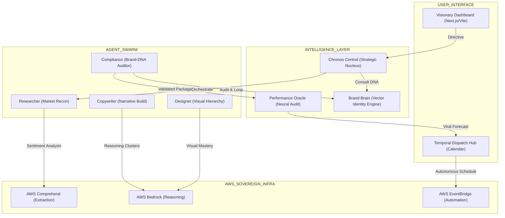

# 🌌 CloudCraft AI: The Sovereign Agentic OS for Bharat's Digital Economy

**Hackathon:** AI for Bharat 🇮🇳  
**Track:** AI for Media, Content & Digital Experiences  

**Mission:**  
*To turn the chaos of global marketing into a self-executing, autonomous engine—weaponizing brand identity and culture to ensure Bharat's digital presence dominates the global stage.*

---

# 🚀 Moving Beyond the "Wrapper": Why CloudCraft is an Agentic Engine

Unlike standard generative AI tools that simply **call an API and return text**, CloudCraft AI is a **Stateful Multi-Agent Orchestration System** designed for high-stakes brand management.

### Recursive Reasoning Cycles
Our agents don't just generate outputs — they **critique and iterate**.

Using a **LangGraph-driven state machine**, the Compliance Agent can reject outputs and force **re-synthesis** if they violate **Brand Brain guardrails**.

### Contextual Intelligence Transmutation
We move beyond translation into **Cultural Transmutation**.

The system understands **regional Indian archetypes**, dynamically adapting brand messaging based on **local sentiment and cultural triggers**.

### Autonomous Sovereignty
With **SOVEREIGN AUTOMATE mode**, the system becomes an **Autonomous Marketing Manager**.

It actively:
- Searches for market opportunities
- Analyzes competitor weaknesses
- Launches campaigns automatically using **Tavily deep search**

---

# 🏛️ Neural Architecture Diagram



---

# 🛠️ High-Performance AWS Synergy & Strategic Importance

| AWS Service | Strategic Role |
|-------------|---------------|
| AWS Bedrock | Core reasoning engine powering multi-agent swarm |
| AWS Comprehend | Sentiment analysis and entity extraction |
| AWS EventBridge | Campaign automation scheduling |
| AWS S3 / DynamoDB | Persistent campaign memory |

---

# 🏆 Full Feature Suite

## 🧠 Brand Brain
Vector-based identity guardrails that ensure brand consistency.

## 🛠️ The Forge
Multi-agent creative workspace with auto-optimization loops.

## 🇮🇳 Project Vernacular
Regional adaptation across **22+ Indian languages**.

## 🏛️ Campaign Architect
Autonomous competitor monitoring and market gap detection.

## 🎨 Vision Lab
AI-powered cinematic marketing asset generation.

## 👁️ Performance Oracle
Predicts campaign virality and audience resonance.

---

# ⚙️ Setup Procedure

## Backend

```bash
cd backend
python -m venv venv
source venv/bin/activate
pip install -r requirements.txt

cp .env.example .env

uvicorn src.main:app --host 0.0.0.0 --port 8000 --reload
```

---

## Frontend

```bash
cd frontend
npm install

VITE_API_BASE_URL=http://localhost:8000

npm run dev
```

---

# ☁️ Production Deployment

### Frontend
Deploy using **Vercel**

Environment variable:

```
VITE_API_BASE_URL=<HF_BACKEND_URL>
```

### Backend
Deploy to **HuggingFace Spaces**

Secrets:

```
AWS_ACCESS_KEY_ID
AWS_SECRET_ACCESS_KEY
TAVILY_API_KEY
```

---

# 🌍 Vision

CloudCraft AI turns marketing into an **autonomous strategic intelligence system**, moving from simple digitization toward **Autonomous Digital Sovereignty**.

---

**Built for AI for Bharat Hackathon 2026**
